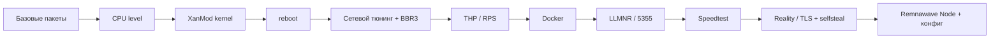

<div align="center">

# 🌒 Eclipse Node Manager

### BBR3 · XanMod · Remnawave Node — установка и управление одной командой

Автоматическая настройка VPS под **Remnawave Node**: свежее ядро XanMod, BBR3, сетевой тюнинг, Docker, нода с готовым конфигом инбаундов, фаервол и обновление ядра Xray — из одного меню.

<br>

[](https://t.me/Light_Eclipse)


</div>

---

## ✨ Возможности

| | |
|---|---|
| 🧬 **XanMod (последняя версия)** | Ставится из официального APT-репозитория — всегда свежее ядро |
| 🚀 **BBR3 + сетевой тюнинг** | Оптимальные sysctl, fq qdisc, RPS, отключение THP |
| 🐳 **Умная установка Docker** | Каскад: get.docker.com → офиц. репозиторий → docker.io |
| 🛰️ **Remnawave Node** | Готовый `docker-compose.yml` + автозапуск контейнера |
| 🔐 **Reality или TLS** | Генерация конфига инбаундов: shortId и ключи x25519 — на сервере |
| 🌀 **Hysteria2 (опц.)** | UDP-инбаунд поверх Reality/TLS с сертификатом Let's Encrypt |
| 🧩 **Обновление ядра Xray** | Стабильная/актуальная версия, arm64, проверка контрольной суммы |
| 🔥 **Фаервол UFW** | Порты 22/80/443 по умолчанию, меню управления портами |
| 📜 **Автопродление сертификата** | `certbot` deploy-hook сам перезапускает ноду после обновления |
| 📊 **Speedtest** | iperf3 (РФ) и **Ookla** (ближайший мировой сервер) |
| ⚡ **Команда `eclipse`** | После установки менеджер открывается одной командой |

---

## ⚡ Быстрый старт

> [!WARNING]
> Перед установкой ядра убедись, что у VPS есть доступ к **VNC/Rescue-консоли** — на случай, если сервер не загрузится после `reboot`. Запускать нужно от `root`.

**Скачать и запустить:**

```bash
curl -fL -o eclipse.sh https://raw.githubusercontent.com/blantxxv/bbr3/main/bbr3-remnanode-auto.sh
chmod +x eclipse.sh
sudo ./eclipse.sh
```

Или одной строкой:

```bash
sudo bash -c "$(curl -fsSL https://raw.githubusercontent.com/blantxxv/bbr3/main/bbr3-remnanode-auto.sh)"
```

После первой установки менеджер снова открывается командой:

```bash
eclipse
```

> [!TIP]
> Автоматический режим без меню: `sudo ./eclipse.sh --auto`
> Подробный лог всех команд: `DEBUG=1 sudo ./eclipse.sh --auto`

---

## 🧭 Главное меню

| # | Пункт | Что делает |
|:-:|-------|------------|
| **1** | Автоматическая установка | Весь пайплайн: ядро → тюнинг → Docker → нода |
| **2** | Продолжить после reboot | Второй этап после установки ядра |
| **3** | Ручная установка | Показывает README/команды |
| **4** | Настройка WARP | Запуск Eclipse WARP Manager |
| **5** | Обновления скрипта | Проверка и установка новой версии |
| **6** | Проверить систему | Ядро, BBR, qdisc, THP, Docker |
| **7** | Torrent Blocker | Установка/переустановка |
| **8** | Обновление ядра Xray | Стабильная/актуальная версия ядра |
| **9** | Настройка портов (UFW) | Открытые порты, добавить/закрыть |
| **0** | Выход | |

---

## 🛠️ Что делает автоматическая установка



После установки ядра сервер уходит в **reboot**. Зайди снова по SSH под `root` — скрипт сам продолжит настройку и попросит `SECRET_KEY` от Remnawave Panel.

---

## 🔐 Типы транспорта

При установке выбирается один из двух вариантов:

<table>
<tr>
<td width="50%" valign="top">

### 🟣 TCP + REALITY
Маскировка через `selfsteal.sh` (Caddy).
Скрипт сам:
- сгенерирует **shortId**;
- сгенерирует пару ключей **x25519** на сервере;
- соберёт готовый `panel-inbounds.json`;
- покажет **publicKey** для клиента.

</td>
<td width="50%" valign="top">

### 🔵 TCP + TLS
Свой домен + сертификат **Let's Encrypt** (certbot).
Скрипт сам:
- выпустит/переиспользует сертификат;
- смонтирует `/etc/letsencrypt` в контейнер;
- соберёт `panel-inbounds.json` (VLESS+TLS);
- настроит **автопродление** с рестартом ноды.

</td>
</tr>
</table>

> [!NOTE]
> К любому варианту опционально добавляется **Hysteria2 (UDP)** — отдельный инбаунд с настоящим TLS-сертификатом. Теги инбаундов генерируются уникальными (`протокол_порт_суффикс`), чтобы не путать ноды между собой.

---

## 🧩 Обновление ядра Xray

Пункт меню **8** (или `eclipse --xray-core`):

- показывает **текущую** версию в контейнере;
- предлагает **стабильную** и **актуальную** (последний релиз) версии;
- определяет архитектуру: `amd64` / `arm64` / `armhf`;
- **проверяет контрольную сумму** (SHA256 из `.dgst`);
- монтирует ядро в контейнер и перезапускает ноду.

Ту же версию ядра можно выбрать **прямо при установке** ноды.

---

## 🔥 Настройка портов (UFW)

Пункт меню **9** (или `eclipse --firewall`):

- по умолчанию открыты **22 (SSH), 80, 443**;
- показывает список открытых портов;
- добавление/закрытие порта, вкл/выкл фаервола;
- при установке ноды её порты открываются автоматически, если UFW активен.

---

## 📟 CLI-команды

```bash
eclipse                    # главное меню
eclipse --auto             # автоматическая установка
eclipse --continue         # продолжить после reboot
eclipse --xray-core        # обновить ядро Xray
eclipse --firewall         # настройка портов (UFW)
eclipse --warp             # настройка WARP
eclipse --torrent-blocker  # Torrent Blocker
eclipse --test             # проверка системы
eclipse --check-update     # проверить обновления
eclipse --help             # все команды
```

Лог установки: `/var/log/bbr3-remnanode-install.log`
Смотреть в реальном времени: `tail -f /var/log/bbr3-remnanode-install.log`

---

<details>
<summary><b>🧱 Ручная установка (без скрипта) — развернуть</b></summary>

<br>

Рекомендуется выполнять от `root` (`sudo -i`).

### 1. Базовые пакеты

```bash
apt update
apt install -y curl wget gpg ca-certificates nano vim htop btop git unzip jq \
  dnsutils iperf3 mtr-tiny iproute2 net-tools iptables ipset conntrack openssl python3 file
```

### 2. Проверка CPU level для XanMod

```bash
awk 'BEGIN{while(!/flags/) if (getline<"/proc/cpuinfo"!=1) exit; level=1
  if(/lm/&&/cmov/&&/cx16/&&/sse4_1/&&/sse4_2/&&/ssse3/&&/popcnt/) level=2
  if(level==2&&/avx/&&/avx2/&&/bmi1/&&/bmi2/&&/f16c/&&/fma/) level=3
  if(level==3&&/avx512f/&&/avx512bw/) level=4; print "v"level}'
```

`v3`/`v4` → `x64v3`, `v2` → `x64v2`, ниже — XanMod пропускается.

### 3. Установка XanMod (последняя версия из репозитория)

```bash
curl -fsSL https://dl.xanmod.org/archive.key | gpg --dearmor -o /usr/share/keyrings/xanmod-archive-keyring.gpg
echo 'deb [signed-by=/usr/share/keyrings/xanmod-archive-keyring.gpg] http://deb.xanmod.org releases main' \
  > /etc/apt/sources.list.d/xanmod-release.list
apt update
apt install -y linux-xanmod-x64v3   # или linux-xanmod-x64v2
update-grub
reboot
```

После reboot:

```bash
uname -r
modprobe tcp_bbr
cat /sys/module/tcp_bbr/version
```

### 4. Сетевой тюнинг

```bash
modprobe tcp_bbr
cat >/etc/sysctl.d/99-net-tuning.conf <<'EOF_SYSCTL'
net.ipv4.tcp_congestion_control = bbr
net.core.default_qdisc = fq

net.core.rmem_max = 67108864
net.core.wmem_max = 67108864
net.core.rmem_default = 1048576
net.core.wmem_default = 1048576
net.core.optmem_max = 4194304

net.ipv4.tcp_rmem = 4096 1048576 33554432
net.ipv4.tcp_wmem = 4096 1048576 33554432
net.ipv4.udp_rmem_min = 16384
net.ipv4.udp_wmem_min = 16384

net.core.netdev_max_backlog = 65536
net.core.netdev_budget = 600
net.core.somaxconn = 65535

net.ipv4.tcp_max_syn_backlog = 65536
net.ipv4.tcp_max_tw_buckets = 2000000
net.ipv4.tcp_max_orphans = 262144

net.ipv4.tcp_fastopen = 3
net.ipv4.tcp_mtu_probing = 1
net.ipv4.tcp_min_snd_mss = 512
net.ipv4.tcp_slow_start_after_idle = 0
net.ipv4.tcp_notsent_lowat = 131072
net.ipv4.tcp_no_metrics_save = 1
net.ipv4.tcp_ecn = 1
net.ipv4.tcp_tw_reuse = 1
net.ipv4.tcp_fin_timeout = 10
net.ipv4.tcp_keepalive_time = 600
net.ipv4.tcp_keepalive_intvl = 30
net.ipv4.tcp_keepalive_probes = 4

net.ipv4.ip_local_port_range = 1024 65535
net.ipv4.ip_forward = 1
net.ipv4.conf.all.forwarding = 1
net.ipv6.conf.all.forwarding = 1

net.netfilter.nf_conntrack_max = 1048576
net.netfilter.nf_conntrack_tcp_timeout_established = 7440

fs.file-max = 2097152
fs.nr_open = 2097152
fs.inotify.max_user_watches = 1048576

vm.swappiness = 10
vm.overcommit_memory = 1
vm.max_map_count = 262144
vm.min_free_kbytes = 131072
EOF_SYSCTL

sysctl --system
sysctl net.ipv4.tcp_congestion_control net.core.default_qdisc
```

### 5. Отключение THP

```bash
cat >/etc/systemd/system/disable-thp.service <<'EOF_SERVICE'
[Unit]
Description=Disable Transparent Huge Pages
After=multi-user.target

[Service]
Type=oneshot
ExecStart=/bin/sh -c 'echo never > /sys/kernel/mm/transparent_hugepage/enabled; echo never > /sys/kernel/mm/transparent_hugepage/defrag'

[Install]
WantedBy=multi-user.target
EOF_SERVICE

systemctl daemon-reload
systemctl enable --now disable-thp.service
cat /sys/kernel/mm/transparent_hugepage/enabled
```

### 6. Docker

```bash
curl -fsSL https://get.docker.com | sh
mkdir -p /etc/docker
cat >/etc/docker/daemon.json <<'EOF_DOCKER'
{
  "log-driver": "json-file",
  "log-opts": { "max-size": "100m", "max-file": "5" },
  "registry-mirrors": ["https://mirror.gcr.io"],
  "default-ulimits": {
    "nofile": { "Name": "nofile", "Hard": 1048576, "Soft": 1048576 },
    "nproc":  { "Name": "nproc",  "Hard": 1048576, "Soft": 1048576 }
  },
  "live-restore": true
}
EOF_DOCKER

systemctl enable docker
systemctl restart docker
docker version && docker compose version
```

### 7. Remnawave Node

```bash
mkdir -p /opt/remnanode/logs
cd /opt/remnanode

curl -fL -o geosite.dat https://github.com/Loyalsoldier/v2ray-rules-dat/releases/latest/download/geosite.dat
curl -fL -o geoip.dat   https://github.com/Loyalsoldier/v2ray-rules-dat/releases/latest/download/geoip.dat
touch logs/access.log logs/error.log

cat >.env <<'EOF_ENV'
NODE_PORT=2222
SECRET_KEY=СЕКРЕТ_С_ПАНЕЛИ
EOF_ENV
chmod 600 .env

cat >docker-compose.yml <<'EOF_COMPOSE'
name: remnanode

services:
  remnanode:
    container_name: remnanode
    hostname: remnanode
    image: remnawave/node:latest
    network_mode: host
    restart: always
    cap_add:
      - NET_ADMIN
    volumes:
      - ./geosite.dat:/usr/local/share/xray/geosite.dat:ro
      - ./geoip.dat:/usr/local/share/xray/geoip.dat:ro
      - ./logs:/var/log/remnanode
    ulimits:
      nofile:
        soft: 1048576
        hard: 1048576
    env_file:
      - .env
EOF_COMPOSE

docker compose up -d
docker compose ps
```

> Используй `image: remnawave/node:latest`. Вариант `ghcr.io/remnawave/nodelatest` отдаёт ошибку registry `denied`.

</details>

---

## 🧰 Обслуживание

```bash
cd /opt/remnanode

docker compose ps                       # статус
docker compose logs -f --tail=100       # логи в реальном времени
docker compose restart                  # перезапуск
docker compose pull && docker compose up -d   # обновить образ ноды

sysctl net.ipv4.tcp_congestion_control  # проверить BBR
cat /sys/module/tcp_bbr/version         # версия BBR
ss -tulpen                              # активные порты
```

---

<div align="center">

### 💬 Сообщество и поддержка

Новости, обновления и помощь по проекту — в Telegram:

[](https://t.me/Light_Eclipse)

<sub>🌒 Eclipse Node Manager — сделано для тех, кто ценит скорость и порядок.</sub>

</div>
